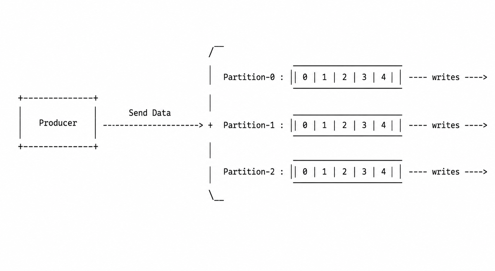
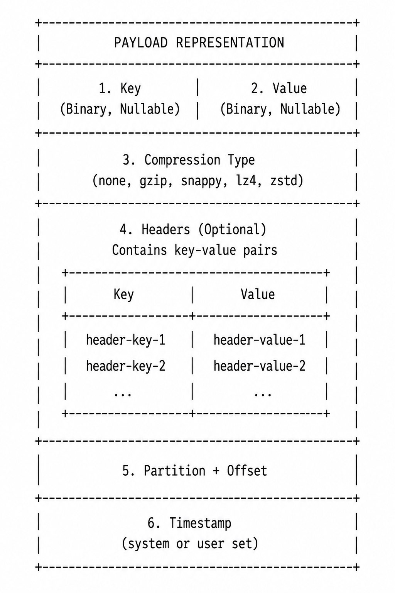
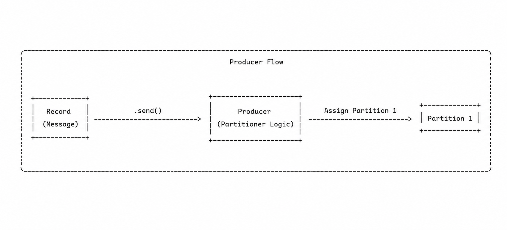

# Kafka

- Contains code, concepts, and topics related to Apache Kafka.

## Table of Contents

- [Kafka](#kafka)
  - [Table of Contents](#table-of-contents)
  - [Why Kafka?](#why-kafka)
    - [The Problem](#the-problem)
    - [The Solution](#the-solution)
  - [Why Use Kafka?](#why-use-kafka)
    - [Use Cases of Kafka](#use-cases-of-kafka)
  - [Kafka Components](#kafka-components)
  - [Kafka Topics, Partitions, and Offsets](#kafka-topics-partitions-and-offsets)
    - [Topics](#topics)
    - [Partitions \& Offsets](#partitions--offsets)
    - [Topic Example: `truck_gps`](#topic-example-truck_gps)
    - [Topics, Partitions, and Offsets — Important Notes](#topics-partitions-and-offsets--important-notes)
  - [Producers \& Message Keys](#producers--message-keys)
    - [Producers](#producers)
    - [Producers: Message Keys](#producers-message-keys)
      - [Kafka Message Anatomy](#kafka-message-anatomy)
      - [Kafka Message Serializer](#kafka-message-serializer)
      - [Kafka Message Key Hashing](#kafka-message-key-hashing)

---

## Why Kafka?

### The Problem

- If you've data interaction between source systems and target systems, and when they increase in numbers, the integration becomes extremely difficult. Ex: Assume that there are 4 source systems, and 6 target systems, in such a case, you might need to write `6 * 4 = 24` integrations.
- Each integration may come with difficulties around:
  1. Protocol &mdash; how the data is transported (TCP, HTTP, REST, FTP, JDBC, etc).
  2. Data Format &mdash; how the data is parsed (Binary, CSV, JSON, Avro, Protobuf, etc).
  3. Data Schema & Evolution &mdash; how the data is shaped and change during the course of newer requirements.
- Each source system will have an **increase load** from the connections.

[⬆️](#table-of-contents)

### The Solution

> We decouple the data streams and systems.

```txt
  source-1      source-2      source-3      source-4
      |             |             |             |
      |             |             |             |
      +-------------+-------------+-------------+
                        |
                        |
                      KAFKA
                        |
                        |
      +--------+--------+--------+--------+--------+--------+
      |        |        |        |        |        |        |
  target-1  target-2  target-3  target-4 target-5 target-6  target-7
```

- We still have the same source systems and target systems present, but now the integrations are decoupled by making use of **KAFKA**.
- Apache Kafka will have the streaming data that has been ***produced* by source systems**, and which will be ***consumed* by target systems**.
- Example:
  - Source Systems: Website Events, Pricing Data, Financial Transactions, and User Interactions.
  - Target Systems: Database, Analytics, Email System, and Audit.

[⬆️](#table-of-contents)

---

## Why Use Kafka?

- Created by LinkedIn, now an open source project, which is mainly maintained by Confluent, IBM, and Cloudera.
- It's Distributed, Resilient Architecture, Fault Tolerant.
- Provides Horizontal Scalability:
  - Can scale to 100s of brokers.
  - Can scale to millions of messages per second.
- High Performance &mdash; Realtime latency is < 10ms.
- Used by 2000+ firms, 80% of Fortune 100 companies:
  - LinkedIn, AirBnb, Netflix, Uber, Walmart, etc., are some big companies that make use of Apache Kafka.

[⬆️](#table-of-contents)

### Use Cases of Kafka

Apache Kafka can be used for the following use cases:

- Messaging System.
- Activity Tracking.
- Gather metrics from many different locations.
- Application logs gathering (one of the first use cases for Kafka).
- Stream Processing (with Kafka Streams API).
- De-coupling of system dependencies.
- Integration w/ Spark, Flink, Storm, Hadoop, and many other Big Data Technologies.
- Micro-services pub/sub interaction.

***Real World Examples***

- Netflix uses Kafka to apply recommnedations in real-time while you're watching TV shows.
- Uber uses Kafka to gather user, taxi, and trip data in real-time to compute and forecast demand, and compute surge pricing in real-time.
- LinkedIn uses Kafka to prevent spam, collect user interactions to make better connection recommendations in real-time.

> Summary:  Kafka is a transportation mechanism which allows huge data flow across different systems.

[⬆️](#table-of-contents)

## Kafka Components

1. Kafka Fundamentals: Topics, Partitions, Offsets, Producers, Consumers, and Interaction with other systems. Beginner level.
2. Kafka Connect API: Understand how to import/export data to/from Kafka.
3. Kafka Streams API: Learn how to process and transform data withing Kafka.
4. `ksqlDB`: Write Kafka Streams application using SQL.
5. Confluent Components: REST Proxy and Schema Registry.
6. Kafka Security: Setup Kafka security in a Cluster and Integration yout applications w/ Kafka.
7. Kafka Monitoring & Operations: Use Prometheus and Grafana to monitor Kafka, and learn Operations.
8. Kafka Cluster Setup & Administration: Get a deep understanding of how Kafka & Zookeeper works, how to Setup Kafka, and varios administration tasks.

[⬆️](#table-of-contents)

---

## Kafka Topics, Partitions, and Offsets

### Topics

- A particular stream of data within your Kafka Cluster. A cluster can have many topics which can be `logs`, `purchases`, `twitter_tweets`, or `trucks_gps`.

  ```txt
  +--------------------------------------------------+
  |                  Kafka Cluster                   |
  |--------------------------------------------------|
  |                                                  |
  |   +--------------------+                         |
  |   |  Topic: logs       |                         |
  |   +--------------------+                         |
  |                                                  |
  |   +--------------------+                         |
  |   |  Topic: purchases  |                         |
  |   +--------------------+                         |
  |                                                  |
  |   +--------------------------+                   |
  |   |  Topic: twitter_tweets   |                   |
  |   +--------------------------+                   |
  |                                                  |
  |   +-----------------------+                      |
  |   |  Topic: trucks_gps    |                      |
  |   +-----------------------+                      |
  |                                                  |
  +--------------------------------------------------+
  ```

- Like a table in a database (without all the constraints, meaning we can send whatever we want to a Kafka Topic)
- You can have as many topics as you want in a Kafka Cluster.
- A topic is identified by its name.  Example: `logs`, or `purchases`.
- Any kind of message format is supported (JSON, XML, Avro, Protobufs, etc)
- The sequence of messages is called a **data stream**.
- You cannot query topics (although they're similar to tables without constraints and schema in databases), instead, use Kafka Producers to send data and Kafka Consumers to read the data.
- Kafka Topics are **immutable**: once data is written to a partition, it cannot be changed.

[⬆️](#table-of-contents)

### Partitions & Offsets

- *Topics are split* in **Partitions** (Eg: 100 partitions).
  - Messages within each partition are ordered.
  - Each *message within a partition gets an incremental id*, called **Offset** [or a Kafka partition offset].

  ```txt
                                     /‾
                                     |  Partition-0 : | 0 | 1 | 2 | 3 | 4 |   ---- writes ---->
  +-------------+                    |  
  | purchases   |--------------------+  Partition-1 : | 0 | 1 | 2 | 3 | 4 |   ---- writes ---->
  |   (topic)   |                    |
  +-------------+                    |  Partition-2 : | 0 | 1 | 2 | 3 | 4 |   ---- writes ---->
                                     \_
                                      
  ```

[⬆️](#table-of-contents)

### Topic Example: `truck_gps`

- So you've a fleet of trucks; each truck reports its GPS position to Kafka.
- Each truck will send a message to Kafka every 20s, each message will contain the truck ID and the truck position (lat and long).
- You can have a topic named `trucks_gps` that contains the position of all trucks.
- We choose to create a topic with 10 partitions (arbitrary number).
- All of this data going through Kafka, can be consumed by something like:
  - Location Dashboard (to know the status of delivery)
  - Notification Service (to send notifications to users delivery status).

```txt
Fleet of Trucks (GPS update every 20s)
================================================================================

  Truck-001      Truck-002      Truck-003            ...            Truck-N
     |               |               |                                 |
     |  { truck_id, lat, lng }       |                                 |
     +---------------+---------------+--------------- ... -------------+
                                     |
                                     v
                      +--------------------------------------------------+
                      |                 Kafka Cluster                   |
                      |--------------------------------------------------|
                      |  Topic: trucks_gps  (10 partitions)             |
                      |                                                  |
                      |   P0 : | 0 | 1 | 2 | 3 |                         |
                      |   P1 : | 0 | 1 | 2 |                             |
                      |   P2 : | 0 | 1 | 2 | 3 | 4 |                     |
                      |   ..                                              |
                      |   P9 : | 0 | 1 | 2 |                             |
                      |                                                  |
                      |  Key = truck_id  → ordering per truck            |
                      +---------------------------+----------------------+
                                                  |
                                                  |
                  +-------------------------------+-------------------------------+
                  |                                                               |
                  v                                                               v
      +----------------------------+                         +----------------------------+
      |     Location Dashboard     |                         |    Notification Service    |
      |----------------------------|                         |----------------------------|
      | • Live vehicle locations   |                         | • Delivery status updates  |
      | • Route & delay monitoring |                         | • ETA / delay alerts       |
      +----------------------------+                         +----------------------------+
```

[⬆️](#table-of-contents)

### Topics, Partitions, and Offsets &mdash; Important Notes

- Once the data is written to a partition, **it cannot be changed** (immutability).
- Data is kept only for a limited time (default is 1w - but this is configurable).
- Each offset is unique, meaning that an Offset only has meaning for a specific partition:
  - Offset 3 in Partition-0 doesn't represent the same data as Offset 3 in Partition-9, they're completely different.
  - Offsets are not re-used even if previous messages have been deleted.
- Order is guaranteed by only within a partition [offset is incremental] (not across partitions).
- Data is assigned randomly to a partition unless a key is provided.
- You can have as many partitions per topic as you want.

[⬆️](#table-of-contents)

---

## Producers & Message Keys

### Producers

- Producers write data to topics (which are made of partitions).
- Producers know (in advance) to which partition to write to (and which Kafka broker has it).
- In case of Kafka broker failures, Producers will automatically recover it (there's a lot going on behind the scenes, which we'll look into later).

  

  NOTE: Producer sends some data across all partitions based on some mechanism and this is why Kafka scales. Meaning, each partition receives messages from one or more producers, i.e., there's a load balancer between Producers and Partitions.

[⬆️](#table-of-contents)

### Producers: Message Keys

- Producers can choose to send a **key** with the message (string, number, binary, etc.).
- If `key == null`, data is sent round robin (partition 0, then 1, then 2, so on, so forth, ...).
- If `key != null`, then all messages for that key will always go to the same partition (hashing).
- A key is typically sent if you need message ordering for a specific field (ex: `truck_id`).
  - Example:

    ```txt
                                       /‾
                    -----------------> |  Partition-0 : truck_id_123, truck_id_234 (Data will always be in Partition 0, based on the message key)
    +-------------+/                   |  
    |   PRODUCER  |-- Send Data -----> +  Partition-1 : truck_id_345, truck_id_456 (Data will always be in Partition 1, based on the message key)
    +-------------+                    |
                   \-----------------> |  Partition-2 : truck_id_567, truck_id_678 (Data will always be in Partition 2, based on the message key)
                                       \_
                                        
    ```

[⬆️](#table-of-contents)

#### Kafka Message Anatomy

- Kafka Message Created by a Producer will contain the following Data:
  - Key (Binary, Nullable)
  - Value (Binary, Nullable)
  - Compresstion Type (none, gzip, snappy, lz4, zstd)
  - Headers (Optional) - Contains key-value pairs
  - Partion + Offset
  - Timestamp (system or user set)

  

  The generated Kafka message (from the Producer) is sent to Apache Kafka, for storage.

[⬆️](#table-of-contents)

#### Kafka Message Serializer

> The producer creates the message, but how does it create the message?

- Kafka only accepts bytes as an input from producers and sends bytes out as an output to consumers.
  - When the messages are constructed, they're not direct bits and bytes.
- When we construct the messages, the **message is serialized**, meaning, transforming objects/data into bytes.
- The serializer is only used on the value and the key.
- Example: `{123: "hello world"}`
  - Serializing the Key (`123`):
  
    ```txt
    +-------+
    | 123   |
    +-------+
         |
         | int
         v
    +-----------------------------------+
    | KeySerializer=IntegerSerializer   |
    +-----------------------------------+
         |
         | bytes
         v
    +----------------------+
    | 01110011             |
    |   (binary output)    |
    +----------------------+
    ```
  
  - Serializing the Value (`"hello world"`)

    ```txt
    +-------------------+
    | "hello world"     |
    +-------------------+
              |
              | string
              v
    +-----------------------------------+
    | ValueSerializer=StringSerializer  |
    +-----------------------------------+
              |
              | bytes
              v
    +---------------------------------------------+
    | 001100100011100101001001001010101000101     |
    |               (binary output)               |
    +---------------------------------------------+
    ```

- Kafka Producers come with Common Serializers:
  - String (including JSON)
  - Integer, Float, etc
  - Avro
  - Protobuf

[⬆️](#table-of-contents)

#### Kafka Message Key Hashing

- A **Kafka Partitioner** is a code logic that takes a record and determines to which partition to send it into. 
- **Key Hashing** is the process of determining the mapping of a key to a partition.
- In the default Kafka partitioner, the keys are hashed using the `murmur2` algorithm, with the formula below for the curios:

  ```java
  targetPartition = Math.abs(Utils.murmur2(keyBytes)) % (numPartitions - 1)
  ```

[⬆️](#table-of-contents)
